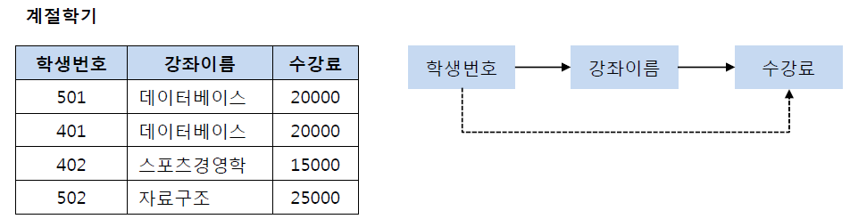

## 정규화

DB 정규화의 목적은 결국 **‘데이터 중복을 제거하는 것’**

### 왜 중복 제거가 되어야 하는데

데이터의 중복으로 인한 anomaly 발생 방지, 데이터 무결성 보장.

### Anomaly

1. 삭제 이상 : 삭제 시 필요한 정보까지 같이 삭제
2. 갱신 이상 : 갱신 시 중복된 다수의 데이터에 영향 (무결성 문제 염려)
3. 삽입 이상 : 삽입 시 다른 속성에 의해 삽입에 지장

보통 3차, BCNF 정규화까지 진행하고 4,5차는 더 심화되므로 이후에 학습.

- **1차 정규화 :** 모든 속성의 원자성 보장

- **2차 정규화 :** 부분 종속성 제거

`성적`은 `{학생번호, 강좌이름}` 모두에 종속성을 가지지만 `강의실`은 `강좌이름`에만 종속성을 가짐.

부분 종속성을 제거할 수 있게 릴레이션 나누기.

- **3차 정규화 :** 속성 간 이행 종속성 제거 (A -> B, B-> C 일 때, A -> C가 되지 않도록 분해)

`학생번호 -> 강좌이름`, `강좌이름 -> 수강료`의 함수 종속성으로 인해 `학생번호 -> 수강료`의 이행 종속성을 가짐.
`학생번호 -> 강좌이름 -> 수강료` , `학생번호 -> 수강료` 두 가지의 함수 종속성은 중복되기에 릴레이션 나누기.

`학생번호 -> 강좌이름 -> 수강료`만 됨.

- **BCNF :** 수퍼키가 아닌 속성이 함수적 종속성을 가질 때, 해당 속성이 수퍼키가 되도록 분해
  **(+ 모든 결정자가 수퍼키가 되도록)**

`교수 -> 특강이름` 종속성에서 `교수`는 수퍼키가 아니기에 수퍼키가 될 수 있도록 릴레이션 나누기.

이처럼 모든 결정자가 수퍼키(후보키)가 되도록 함.

이미지 출처 : https://mangkyu.tistory.com/110
